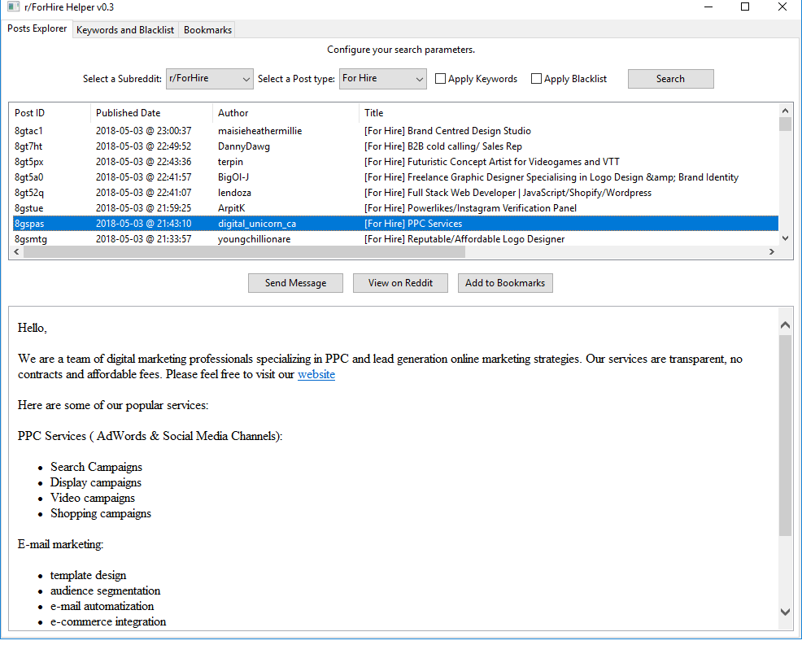

# r/ForHire Helper

r/ForHire Helper is a free and open source Python desktop application that helps freelancers and employers find the best candidates faster and easier.


It uses the following libraries and technologies:

* wxPython 4 for the GUI framework and to preview Reddit posts.
* Requests to communicate with the Reddit JSON API.
* SQLite to manage keywords, blacklists and bookmarks.

## Dependencies

```
pip install -r requirements.txt
```

Note: macOS and Linux users must use `pip3` instead of `pip`.

## How to Use

After you have downloaded this repository and installed the required dependencies you will only require to run the following commands.

```
cd path/to/forhire/
python main.py
```

Note: macOS and Linux users must use `python3` instead of `python`.

After running those commands a new window will appear with 3 tabs.

The first tab contains a button that will connect to the Reddit API and will download the latest posts from the selected Subreddit, the default one is [r/ForHire](https://www.reddit.com/r/forhire).

Those posts will be filtered between `For Hire` and  `Hiring`, or their equivalents in each subreddit. You can apply your custom keywords and blacklists by checking their respective boxes.

Adding new keywords and blacklists is done in the second tab. Where you would only require to type individual words and press the `Add` button. Selecting a previous saved item and pressing the `Delete` button will delete it from your database.

In the third tab you will be presented with all the posts you have bookmarked from the first tab. Everytime you navigate to this tab the bookmarks will be automatically updated.

## Preview



## Download

For your convenience a Windows 64-bit executable is available, you can download it directly from GitHub.

[](https://github.com/PhantomInsights/forhirehelper/releases/download/v0.3/forhire.exe)